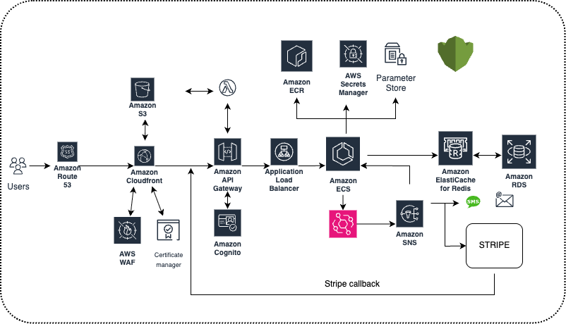

# E-Commerce Platform on AWS

> <mark>**Note:** There is a story behind this Project. You'd want to read through it to get a sense of how I reached the conclusions for some technical decisions. Also, it gives you a better perspecitve on my thought process as I worked on it. 
Have a read on my [dev.to page](https://dev.to/oscarrobertstar/reverse-learning-with-ai-breaking-down-ai-generated-business-cases-into-technical-solutions-42bb). I'd love to hear your thoughts on it as you follow through this series.</mark>

## Architecture Overview

*Figure 1: High-level architecture of the e-commerce platform on AWS*

## Core Architecture Components

### Frontend Services
- **Amazon S3**: Hosts static website content (HTML/CSS/JS)
- **Amazon CloudFront**: Global CDN for low-latency content delivery
- **AWS WAF**: Web application firewall for security protection
- **Certificate Manager**: Provides SSL/TLS certificates for secure HTTPS connections

### Backend Services
- **Amazon API Gateway**: REST API endpoint management
- **Application Load Balancer**: Distributes traffic across backend services
- **Amazon Cognito**: User authentication and authorization

### Data & Integration Layer
- **AWS Secrets Manager**: Secure storage of credentials and secrets
- **Parameter Store**: Centralized configuration management
- **Amazon ElastiCache (Redis)**: Caching layer for improved performance
- **Amazon SNS**: Notification service for event-driven architecture

### Payment Processing
- **Stripe Integration**: 
  - Direct Stripe API connections
  - Stripe callback handlers for payment verification

## Key Features
1. **Secure Architecture**:
   - End-to-end encryption (SSL/TLS)
   - WAF protection against common web exploits
   - Cognito for secure user management

2. **Scalable Infrastructure**:
   - CloudFront CDN for global availability
   - Load balanced backend services
   - Redis caching for high throughput

3. **Payment Processing**:
   - PCI-compliant Stripe integration
   - Asynchronous payment verification via callbacks

## Deployment Notes
- All AWS resources provisioned through Infrastructure as Code (Terraform)
- Environment variables managed through Parameter Store
- Secrets (API keys, DB credentials) secured via Secrets Manager